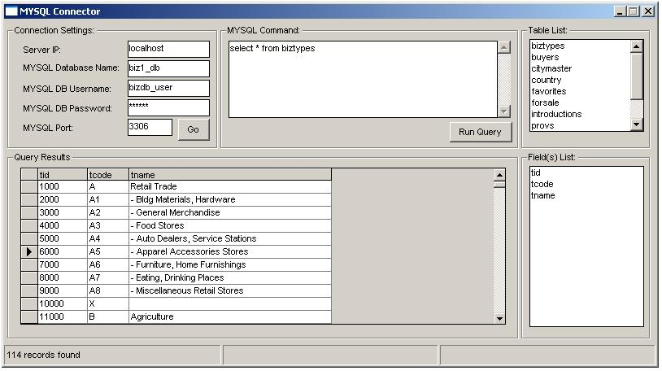



## connect to mysql database using vb

### Description

This code allows you to connect to your mysql database using vb and execute mysql queries. Displays list of tables and fields contained in your database. Good Tutorial to help you connect to your mysql database using visual basic. Please Vote! =) Thanks!
 
### More Info
 

             |
---                |---
**Submitted On**   |2007-06-01 12:40:18
**By**             |[Carlo Rodriguez](https://github.com/Planet-Source-Code/PSCIndex/blob/master/ByAuthor/carlo-rodriguez.md)
**Level**          |Advanced
**User Rating**    |4.3 (34 globes from 8 users)
**Compatibility**  |VB 6\.0
**Category**       |[Databases/ Data Access/ DAO/ ADO](https://github.com/Planet-Source-Code/PSCIndex/blob/master/ByCategory/databases-data-access-dao-ado__1-6.md)
**World**          |[Visual Basic](https://github.com/Planet-Source-Code/PSCIndex/blob/master/ByWorld/visual-basic.md)
**Archive File**   |[connect\_to206857612007\.zip](https://github.com/Planet-Source-Code/carlo-rodriguez-connect-to-mysql-database-using-vb__1-68725/archive/master.zip)

